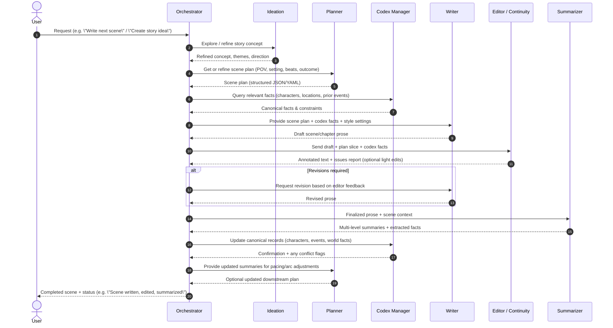

# **Main Project Interaction Diagram**

```mermaid
sequenceDiagram
    autonumber
    actor User

    participant OR as Orchestrator
    participant ID as Ideation
    participant PL as Planner
    participant CM as Codex Manager
    participant WR as Writer
    participant ED as Editor / Continuity
    participant SU as Summarizer

    %% User initiates work
    User->>OR: Request (e.g. \"Write next scene\" / \"Create story idea\")

    %% Optional ideation phase (early or on request)
    OR->>ID: Explore / refine story concept
    ID-->>OR: Refined concept, themes, direction

    %% Plan / refine scene
    OR->>PL: Get or refine scene plan (POV, setting, beats, outcome)
    PL-->>OR: Scene plan (structured JSON/YAML)

    %% Fetch world/context knowledge
    OR->>CM: Query relevant facts (characters, locations, prior events)
    CM-->>OR: Canonical facts & constraints

    %% Draft prose
    OR->>WR: Provide scene plan + codex facts + style settings
    WR-->>OR: Draft scene/chapter prose

    %% Edit / continuity check
    OR->>ED: Send draft + plan slice + codex facts
    ED-->>OR: Annotated text + issues report (optional light edits)

    alt Revisions required
        OR->>WR: Request revision based on editor feedback
        WR-->>OR: Revised prose
    end

    %% Summarize for memory
    OR->>SU: Finalized prose + scene context
    SU-->>OR: Multi-level summaries + extracted facts

    %% Update codex and planner
    OR->>CM: Update canonical records (characters, events, world facts)
    CM-->>OR: Confirmation + any conflict flags

    OR->>PL: Provide updated summaries for pacing/arc adjustments
    PL-->>OR: Optional updated downstream plan

    %% Report back to user
    OR-->>User: Completed scene + status (e.g. \"Scene written, edited, summarized\")
```