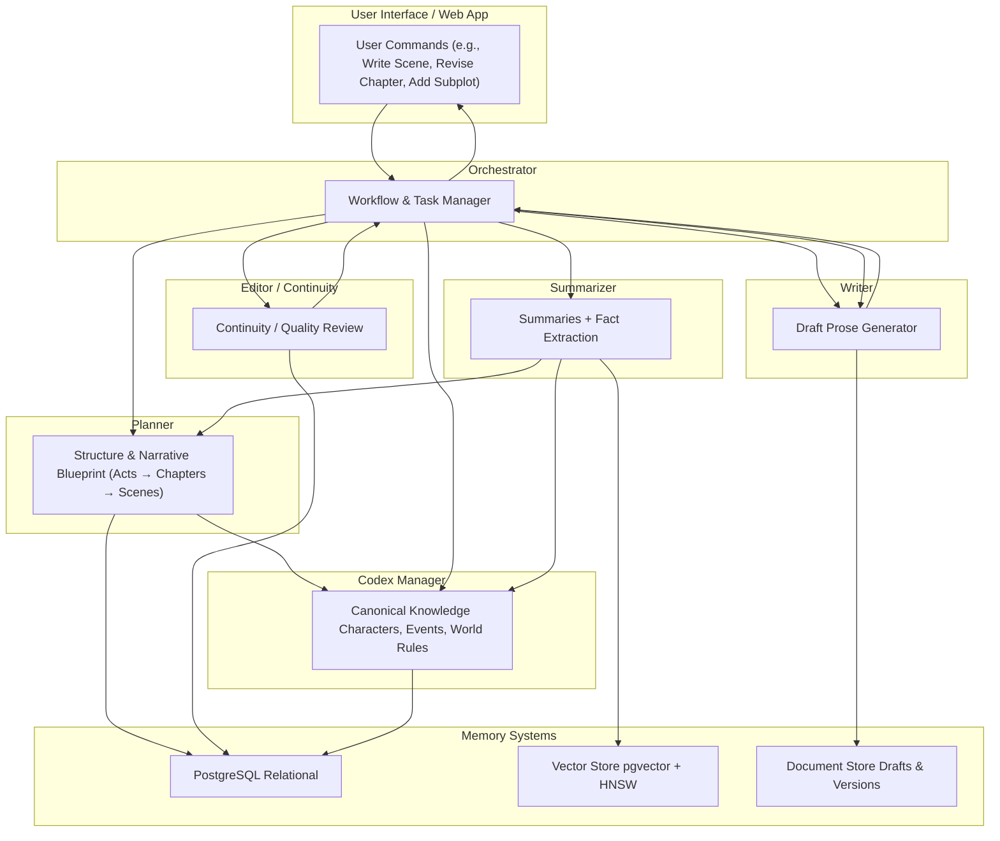

# **Main Project FlowChart**

```mermaid
flowchart TD
    subgraph UserInterface["User Interface / Web App"]
        UI["User Commands (e.g., Write Scene, Revise Chapter, Add Subplot)"]
    end

    subgraph Orchestrator["Orchestrator"]
        OR["Workflow & Task Manager"]
    end

    subgraph Planning["Planner"]
        PL["Structure & Narrative Blueprint (Acts → Chapters → Scenes)"]
    end

    subgraph Writing["Writer"]
        WR["Draft Prose Generator"]
    end

    subgraph Editing["Editor / Continuity"]
        ED["Continuity / Quality Review"]
    end

    subgraph Summarizing["Summarizer"]
        SU["Summaries + Fact Extraction"]
    end

    subgraph Memory["Codex Manager"]
        CM["Canonical Knowledge Characters, Events, World Rules"]
    end

    subgraph Storage["Memory Systems"]
        DB["PostgreSQL Relational"]
        VEC["Vector Store pgvector + HNSW"]
        DOC["Document Store Drafts & Versions"]
    end

    %% User to Orchestrator
    UI --> OR

    %% Planning phase
    OR --> PL
    PL --> CM

    %% Writing phase
    OR --> CM
    OR --> WR

    %% Editing and revision loop
    WR --> OR
    OR --> ED
    ED --> OR
    OR --> WR

    %% Summarization
    OR --> SU
    SU --> CM
    SU --> PL
    SU --> VEC

    %% Storage hooks
    WR --> DOC
    PL --> DB
    ED --> DB
    CM --> DB

    %% Results to user
    OR --> UI
```